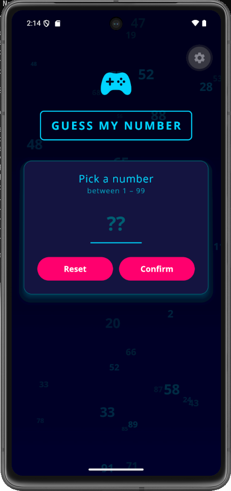
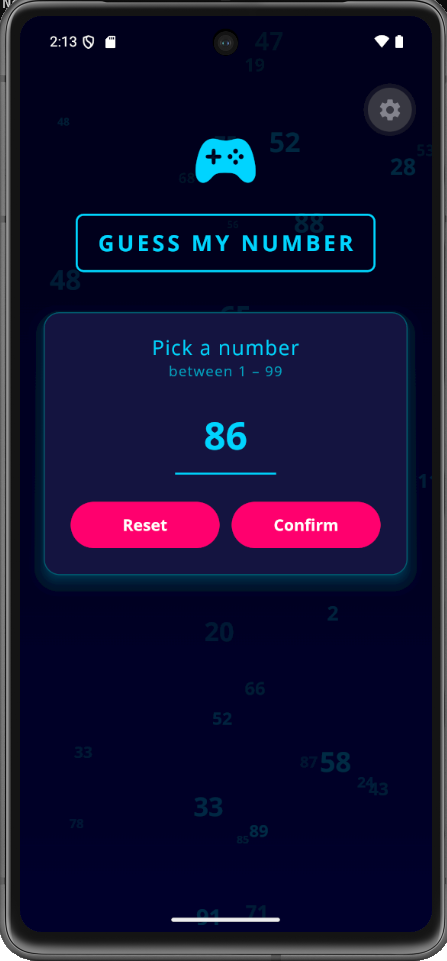
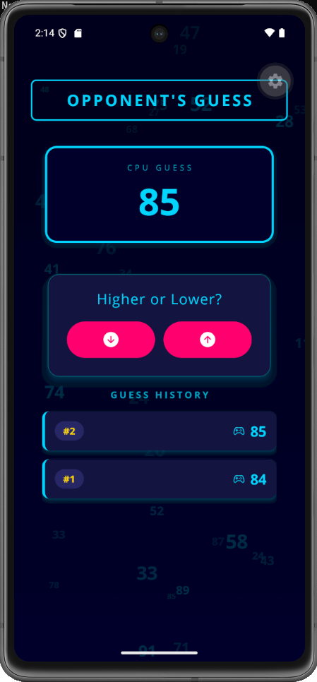
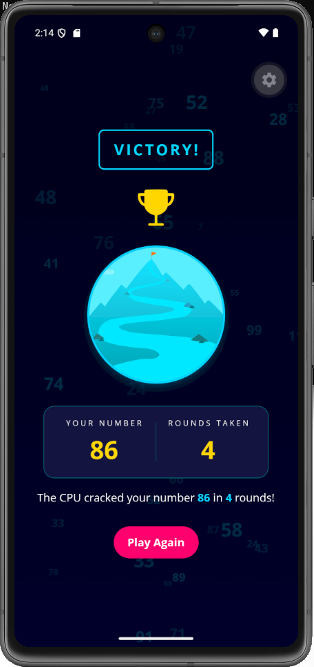

# 🎮 Target Number Game

A cyberpunk-themed React Native number guessing game built with Expo. You pick a secret number and the CPU hunts it down — guide it higher or lower until it cracks your code.

## Screenshots

| Start Screen | New Guess | Game Screen | Game Over |
|---|---|---|---|
|  |  |  |  |

## Gameplay

1. Enter a number between **1 and 99**
2. The CPU makes its first guess
3. Tell it to go **higher ↑** or **lower ↓**
4. Keep guiding it until it finds your number
5. The game tracks every guess in a scrollable history log
6. When the CPU wins, your stats are shown on the Victory screen

## Tech Stack

- [React Native](https://reactnative.dev/) + [Expo SDK 56](https://docs.expo.dev/versions/v56.0.0/)
- [expo-linear-gradient](https://docs.expo.dev/versions/v56.0.0/sdk/linear-gradient/) — dark space background
- [@expo/vector-icons](https://docs.expo.dev/guides/icons/) (Ionicons) — UI icons
- [expo-font](https://docs.expo.dev/versions/v56.0.0/sdk/font/) — Open Sans typeface
- [expo-splash-screen](https://docs.expo.dev/versions/v56.0.0/sdk/splash-screen/) — font preloading
- [react-native-safe-area-context](https://docs.expo.dev/versions/v56.0.0/sdk/safe-area-context/) — safe area handling

## Project Structure

```
TargetGame/
├── App.js                        # Root component, navigation state
├── index.js                      # Entry point
├── assets/
│   ├── fonts/                    # OpenSans-Regular & OpenSans-Bold
│   └── images/                   # success.png (victory screen)
├── constants/
│   └── colors.js                 # Cyberpunk color palette
├── screens/
│   ├── StartGameScreen.js        # Number input screen
│   ├── GameScreen.js             # Active game screen
│   └── GameOverScreen.js         # Victory screen
└── componentes/
    ├── game/
    │   ├── NumberContainer.js    # CPU guess display
    │   └── GuessLogItem.js       # Individual guess history row
    └── ui/
        ├── Title.js
        ├── Card.js
        ├── InstructionText.js
        ├── PrimaryButton.js
        └── GameBackground.js     # Animated number scatter background
```

## Getting Started

### Prerequisites

- [Node.js](https://nodejs.org/) v18+
- [Expo Go](https://expo.dev/client) app on your device **or** a development build (required for native modules)

### Install & Run

```bash
git clone https://github.com/YOUR_USERNAME/target-number-game.git
cd target-number-game
npm install
npx expo start --clear
```

Scan the QR code with Expo Go (iOS/Android) or press `a` to open on an Android emulator.

### Development Build (required for physical devices with native modules)

```bash
eas build --profile development --platform android
```

Install the generated APK, then run `npx expo start` to connect.

## Color Palette

| Token | Hex | Usage |
|---|---|---|
| `bg900` | `#07071a` | Deepest background |
| `bg800` | `#0f0f2a` | Gradient end |
| `bg700` | `#181840` | Card surfaces |
| `neon500` | `#00d4ff` | Primary neon cyan |
| `accent500` | `#ff006e` | Buttons, highlights |
| `warning500` | `#ffd60a` | Trophy, stat values |

## License

MIT
